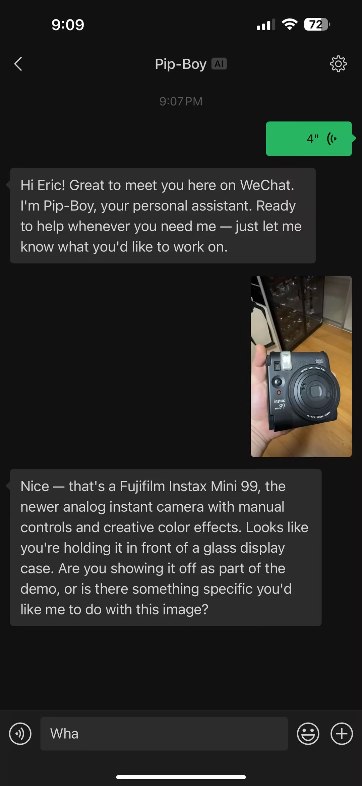
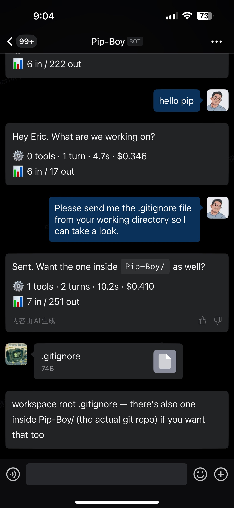
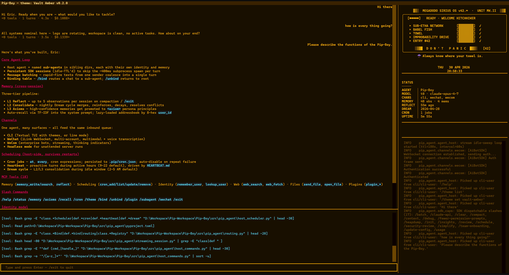
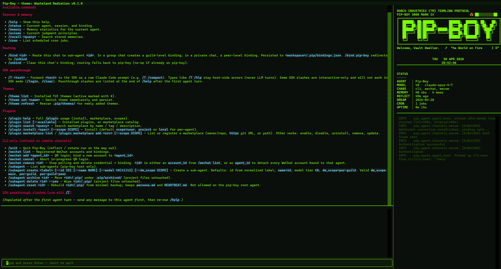

# Pip-Boy

[](https://github.com/ByeDream/Pip-Boy/actions/workflows/ci.yml)
[](https://pypi.org/project/pip-boy/)
[](https://pypi.org/project/pip-boy/)
[](LICENSE)

<p align="center">
  
</p>

A **lean host for Claude Code** that adds persistent cross-session memory, multi-channel delivery (CLI / WeChat / WeCom), a Textual TUI with themes, user identity, and durable scheduling on top of what Claude Code already ships. Pip-Boy does **not** re-implement the agent loop, tool dispatch, or session resume — those are owned by the [Claude Agent SDK](https://github.com/anthropics/claude-agent-sdk-python). Pip-Boy owns what the SDK does not.

## What Pip-Boy adds to Claude Code

### Memory pipeline (cross-session)

Claude Code's JSONL session resume covers an in-flight conversation. Pip-Boy covers **across** conversations:

- **L1 Reflect** — Extracts ≤ 5 high-signal observations per pass from a session's JSONL transcript. Triggered by (a) Claude Code's own `PreCompact` hook (when the context boundary is about to be discarded) and (b) `/exit` (to catch sessions that never hit compact).
- **L2 Consolidate** — Merges observations into memories with reinforcement, decay, and conflict resolution.
- **L3 Axiom Distillation** — Promotes high-stability memories into persona principles (`axioms.md`), wrapped in `<axiom>` tags for priority injection.
- **Dream cycle** — L2 + L3 run together once per idle-hour window when enough observations have accumulated. Scheduler-driven, not agent-driven.
- **Prompt enrichment** — Axioms and relevant memories are injected into the system prompt on every turn via `system_prompt_append`.
- **`reflect` / `memory_search` / `memory_write` MCP tools** — The model can drive reflection and recall on demand.

### Multi-channel host

One Pip-Boy host, many surfaces. All channels feed into the same inbound message queue routed through the same Claude Code agent:

- **CLI** — Interactive REPL with streaming output and UTF-8-safe input on Windows. Default surface, always on.
- **WeChat** — Personal WeChat via WebSocket (iLink). Multi-account: each account gets its own poll thread and an isolated conversation context per peer. Images, files, and voice transcriptions are passed as multimodal content blocks.
- **WeCom** — Enterprise WeCom bots via WebSocket SDK. Progressive streaming replies with thinking indicators and stats footer. Same multimodal path as WeChat.
- **Headless** — `--headless` mode disables TUI, stdin, and the CLI channel entirely; only remote channels (WeCom/WeChat) are active. Suitable for unattended server deployments.

<table align="center"><tr>
  <td align="center"><strong>WeChat</strong><br/></td>
  <td align="center"><strong>WeCom</strong><br/></td>
</tr></table>

### User identity & ACL

- **Shared addressbook, uuid-keyed** — Every contact lives at `<workspace>/.pip/addressbook/<user_id>.md` where `<user_id>` is an opaque 8-hex handle (e.g. `9c8b2a3e`). Root and every sub-agent read and write the same addressbook.
- **Lazy loading, not eager injection** — Contact profiles are **not** dumped into the system prompt. Every `<user_query>` carries a `user_id` attribute (or the literal `unverified`), and the agent calls `lookup_user(user_id)` on demand.
- **`remember_user` MCP tool** — An unverified caller creates a new entry; a verified caller can only update their **own** record.
- **`lookup_user` MCP tool** — Returns the raw markdown profile for a given `user_id`.
- **ACL gate** — All commands are open on every channel except `/subagent`, `/wechat`, and `/exit`, which are **CLI-only**. The `/help` output on remote channels hides these commands entirely.

### Durable scheduling

Claude Code's native cron lives inside the per-turn subprocess, which exits on `end_turn`. Pip-Boy disables it (`CLAUDE_CODE_DISABLE_CRON=1`) and ships its own host-side scheduler:

- **Cron jobs** — `cron_add` / `cron_remove` / `cron_update` / `cron_list` MCP tools. Jobs persist to each agent's own `.pip/cron.json`, survive restarts, coalesce duplicate pending ticks, and auto-disable after repeated failures. Supports `at`, `every`, and minimal `cron` expressions.
- **Heartbeat** — Periodic proactive turn during configured active hours. `HEARTBEAT.md` per agent drives what the model does; `HEARTBEAT_OK` is a sentinel for "nothing to report" (silenced to avoid CLI noise).
- **Dream trigger** — Same scheduler fires the L2/L3 memory pipeline on the configured idle-hour window.

### Streaming sessions (performance)

By default, Pip-Boy keeps one `ClaudeSDKClient` alive per `session_key` to avoid the ~400 ms subprocess spawn + handshake on every turn. Idle sessions are evicted after a configurable TTL. Ephemeral senders (cron/heartbeat) still go through the one-shot `run_query` path. Stale sessions are auto-detected and retried.

### Web search & fetch

Pip-Boy ships its own `web_search` and `web_fetch` MCP tools (enabled by default via `USE_CUSTOM_WEB_TOOLS=true`). `web_search` uses Tavily as the primary provider with automatic DuckDuckGo fallback when `TAVILY_API_KEY` is unset or Tavily errors out. `web_fetch` uses httpx + trafilatura for HTML-to-markdown conversion. Set `USE_CUSTOM_WEB_TOOLS=false` to use Claude Code's native WebSearch/WebFetch instead.

### Delivery out-of-band

- **`send_file` MCP tool** — The model can ship a local file through the active messaging channel. Images are auto-routed through `send_image` for inline preview.
- **`open_file` MCP tool** — Opens a file in the user's editor for collaborative drafting (CLI-focused).

## Installation

**Prerequisites:** Python ≥ 3.11. No separate `claude` CLI install needed — the Claude Agent SDK wheel carries a bundled executable.

```bash
pip install pip-boy
```

### Development (from source)

```bash
git clone https://github.com/ByeDream/Pip-Boy.git
cd Pip-Boy
pip install -e ".[dev]"
```

## Usage

```bash
cd /path/to/your/project
pip-boy                         # TUI by default (line mode if the terminal can't host it)
pip-boy --no-tui                # force line mode (CI, redirected pipes, broken CJK)
pip-boy --headless              # remote channels only, no TUI/stdin (unattended server)
pip-boy --version
pip-boy doctor                  # one-shot env + capability + theme report
```

### Channel enablement rules

Pip-Boy picks which channels to start from what it sees on disk and in the environment — there is no `--mode` flag:

- **CLI** — always on (except in `--headless` mode).
- **WeCom** — enabled iff both `WECOM_BOT_ID` and `WECOM_BOT_SECRET` are set in `.env` (or the process env).
- **WeChat** — auto-started at boot iff at least one valid tier-3 `account_id=...` binding already exists. Each account gets its own poll thread and an isolated conversation context per peer, so one host can serve multiple WeChat identities concurrently. First-time scans go through `/wechat add <agent_id>` from the CLI.

On first launch Pip-Boy scaffolds `.pip/` with defaults, including `.env` from the template. Fill in `ANTHROPIC_API_KEY` (or `ANTHROPIC_AUTH_TOKEN` + `ANTHROPIC_BASE_URL`) and run again.

## Configuration

### `.env`

| Variable | Required | Default | Description |
|---|---|---|---|
| `ANTHROPIC_API_KEY` | Conditional | — | Direct Anthropic credential. |
| `ANTHROPIC_AUTH_TOKEN` | Conditional | — | Proxy-style bearer token. Takes precedence over `ANTHROPIC_API_KEY`. |
| `ANTHROPIC_BASE_URL` | No | — | Custom API endpoint. Promotes any credential to bearer mode for proxy gateways. |
| `MODEL_T0` / `MODEL_T1` / `MODEL_T2` | Yes | — | Three model tiers, strongest → cheapest. Every call site picks a tier and resolves through the table. Background tasks are pinned to fixed tiers in code. On model-invalid errors the chain steps DOWN; never up. |
| `TAVILY_API_KEY` | No | — | Tavily search API key. When empty, `web_search` falls back to DuckDuckGo. |
| `WECOM_BOT_ID` / `WECOM_BOT_SECRET` | No | — | WeCom enterprise bot credentials. |
| `USE_CUSTOM_WEB_TOOLS` | No | `true` | Ship Pip-Boy's own `web_search`/`web_fetch` MCP tools; set to `false` for Claude Code's native WebSearch/WebFetch. |
| `ENABLE_STREAMING_SESSION` | No | `true` | Keep persistent `ClaudeSDKClient` per session. Disable to force one-shot `run_query` on every turn. |
| `BATCH_TEXT_INBOUNDS` | No | `true` | Fuse rapid-fire text messages from the same sender into a single LLM turn. |
| `VERBOSE` | No | `false` | Open the internal log firehose: root at `INFO`, `pip_agent.*` at `DEBUG`. |

At least one of `ANTHROPIC_API_KEY` or `ANTHROPIC_AUTH_TOKEN` must be set, or Claude Code will fall back to its own auth (`claude login`).

### Heartbeat

| Variable | Default | Description |
|---|---|---|
| `HEARTBEAT_INTERVAL` | `1800` | Seconds between heartbeat injections. `0` disables. |
| `HEARTBEAT_ACTIVE_START` | `9` | Local hour (0-23) when heartbeats begin. |
| `HEARTBEAT_ACTIVE_END` | `22` | Local hour (0-23) when heartbeats stop. |

### Dream cycle (L2 / L3 memory)

| Variable | Default | Description |
|---|---|---|
| `DREAM_HOUR_START` | `2` | Local hour when the Dream window opens. |
| `DREAM_HOUR_END` | `5` | Local hour when the Dream window closes. Setting `start == end` disables Dream. |
| `DREAM_MIN_OBSERVATIONS` | `20` | Minimum unconsolidated observations before Dream fires. |
| `DREAM_INACTIVE_MINUTES` | `30` | Minimum minutes of user silence before Dream fires. |

### Performance tuning

| Variable | Default | Description |
|---|---|---|
| `STREAM_IDLE_TTL_SEC` | `180` | Seconds before an idle streaming client is evicted. |
| `STREAM_MAX_LIVE` | `10` | Hard cap on concurrent live streaming clients. |
| `WECHAT_POLL_IDLE_SEC` | `1.0` | Idle backoff for WeChat iLink `getupdates` long-poll. |
| `ART_ANIM_INTERVAL` | `2.0` | Seconds between ASCII art animation frame advances. `0` disables. |
| `PLUGIN_NETWORK_TIMEOUT_SEC` | `180` | Timeout for plugin/marketplace network operations (clone, install). |
| `ENABLE_PROFILER` | `false` | Enable JSONL timing profiler for perf investigations. |

### Per-agent configuration

The workspace root is the home of the default `pip-boy` agent. Additional sub-agents live in their own sibling directories.

**Persona** is split into three files: a per-agent style file and workspace-shared rule files:

```
<workspace>/
  .pip/
    persona.md               # per-agent identity, tone, philosophy
    system_rules.md          # shared system communication + memory + identity rules
    work_rules.md            # shared tool calling + code change + git rules
  <sub-agent-id>/
    .pip/
      persona.md             # independent per-agent style
```

`system_rules.md` and `work_rules.md` are workspace-wide: all agents (root + subs) share the same rules. `persona.md` is per-agent: each agent has its own identity and tone. On each turn, the host composes the system prompt by concatenating persona + shared rules + memory enrichment.

Each `persona.md` carries YAML frontmatter:

```yaml
---
id: pip-boy
name: Pip-Boy
model: t0
dm_scope: per-guild
---

## Identity
You are Pip-Boy, …
```

`model` is a **tier name** (`t0` / `t1` / `t2`), not a concrete model identifier. Concrete names live in `.env` and are resolved at call time. Background tasks (heartbeat, cron, reflect, dream) are pinned to fixed tiers in code and ignore the persona setting. On a model-invalid error the runtime steps DOWN the chain (`t0` → `t1` → `t2`).

Claude Code's `.claude/` configuration is inherited automatically via the Agent SDK's native parent-directory walk-up. See [`docs/identity-model.md`](docs/identity-model.md) for the full three-tier model, sub-agent lifecycle, and `.claude/` override semantics.

### Slash commands

Two separate verb surfaces:

- **`/subagent`** — sibling lifecycle (create, archive, delete, reset, list). Pip-boy only, CLI-only.
- **`/bind` / `/unbind`** — routing pair for *this chat*. Works from any agent, including directly between sibling sub-agents.

| Command | Description |
|---|---|
| `/help` | Show all available commands (CLI-only commands are hidden on remote channels). |
| `/status` | Current agent, session key, binding, and channel. |
| `/memory` | Memory statistics for the current agent. |
| `/axioms` | Current judgment principles (`axioms.md`). |
| `/recall <query>` | Search stored memories. |
| `/cron` | List scheduled cron jobs. |
| `/plugin` | Manage Claude Code plugins / marketplaces. See *Plugins and Marketplaces* below. |
| `/theme` | Manage TUI themes. See *TUI & Themes* below. |
| `/bind <id>` | Route this chat to sub-agent `<id>`. |
| `/unbind` | Clear this chat's binding (fall back to pip-boy). |
| `/wechat` | **CLI-only.** Manage WeChat accounts (`list`, `add <agent_id>`, `cancel`, `remove`). |
| `/subagent` | **pip-boy only, CLI-only.** Sub-agent lifecycle (`list`, `create`, `archive`, `delete`, `reset`). |
| `/exit` | **CLI-only.** Quit Pip-Boy (runs reflect before shutdown). |

`/T <payload>` is a raw SDK passthrough for Claude Code's own `/` commands. Unknown slash commands fail fast with a `Did you mean …?` hint and are **not** forwarded to the model.

### Workspace directory structure

```
<pip_boy_workspace>/
├── .pip/                        # pip-boy (root agent) + workspace runtime
│   ├── persona.md               # pip-boy persona + YAML frontmatter
│   ├── system_rules.md          # shared system communication rules
│   ├── work_rules.md            # shared tool calling + code change rules
│   ├── HEARTBEAT.md
│   ├── addressbook/             # shared contacts — <user_id>.md per contact
│   ├── cron.json                # pip-boy's scheduled jobs
│   ├── state.json               # memory pipeline cursors
│   ├── memories.json            # L2 consolidated memories
│   ├── axioms.md                # L3 judgment principles
│   ├── observations/            # L1 observation files (.jsonl)
│   ├── incoming/                # inbound attachments landing zone
│   ├── credentials/             # channel keys (WeChat / WeCom)
│   ├── bindings.json            # channel → agent routing (workspace-wide)
│   ├── agents_registry.json     # known sub-agents
│   ├── sdk_sessions.json        # session_key → SDK session id
│   ├── host_state.json          # persistent host state (active theme, etc.)
│   ├── log/                     # rotating log files (pip-boy.log)
│   ├── themes/                  # user-editable theme bundles
│   └── .scaffold_manifest.json  # scaffold version tracking
├── ProjectA/                    # plain project; pip-boy operates on it directly
└── <sub-agent-id>/              # sub-agent with its own identity
    ├── .pip/                    # independent persona + memory
    │   ├── persona.md
    │   ├── HEARTBEAT.md
    │   ├── state.json cron.json memories.json axioms.md
    │   └── observations/ incoming/
    └── .claude/                 # optional: local CC overrides
```

## TUI & Themes

Pip-Boy's CLI is a **Textual + Rich TUI** by default — a multi-pane layout with streaming agent output, interactive modals, a side panel (animated ASCII art, clock, agent status, app log), a todo pane, and a status bar — and falls back to plain line mode only when the terminal can't host it.

```text
pip-boy            # TUI by default (line mode if the terminal can't host it)
pip-boy --no-tui   # force line mode
pip-boy doctor     # one-shot env + capability + theme report
```

**Layout:**

- **Agent pane** — split into `#agent-log` (dialog with user/assistant messages) and `#agent-log-detail` (tool arguments, diff previews, plan-mode content).
- **Side pane** — multi-frame ASCII art animation, clock, agent snapshot (model, session, memory stats), and app log.
- **Todo pane** — surfaces `TodoWrite` events from the agent; auto-hides when all items are completed or cancelled.
- **Status bar** — shows blocking tool name after a grace period.
- **Interactive modals** — `AskUserQuestion` and `ExitPlanMode` render as interactive dialogs.
- **Tool summaries** — per-tool argument formatting (Edit/Write diff preview, TaskOutput, ScheduleWakeup, etc.).

Themes are data-driven: a `theme.toml` manifest, a `theme.tcss` Textual CSS file, and `ascii_art_N.txt` frames for animation. Pip-Boy seeds example themes (`wasteland`, `vault-amber`) into `<workspace>/.pip/themes/` on first boot.

<table align="center">
  <tr><td align="center"><strong>Vault Amber</strong><br/></td></tr>
  <tr><td align="center"><strong>Wasteland Radiation</strong><br/></td></tr>
</table>

```text
/theme list                # installed themes (active marked with *)
/theme set <slug>          # switch NOW + persist the new default
/theme refresh             # rescan .pip/themes/ after adding / editing a theme
```

`/theme set` applies the new bundle to the live TUI in one shot — colours, TCSS, and ASCII art all flip, the agent log history is preserved, and the selection is written to `host_state.json` so the next boot comes up in the same theme.

See [`docs/themes.md`](docs/themes.md) for the full author guide.

### Troubleshooting

* **`pip-boy` exits immediately with a Windows runtime error dialog** —
  Textual win32 driver issue with stale `__stdout__` alignment. Pip-Boy
  aligns `sys.__stdout__` / `sys.__stdin__` atomically inside
  `force_utf8_console()`. Run `pip-boy doctor` to confirm the `textual`
  version is `>=1`.
* **TUI stays disabled on a clearly capable terminal** — check
  `<workspace>/.pip/tui_capability.log`. The first failing stage
  (`tty`, `driver`, or `encoding`) tells you which probe disagreed.
* **Updating dependencies fails on Windows** — close any running
  `pip-boy` first. The bundled `claude.exe` keeps a write lock on its
  directory while a host process is alive.

## Plugins and Marketplaces

Pip-Boy reuses Claude Code's native plugin system. The Claude Agent SDK ships a full `claude` CLI inside its wheel, which owns the on-disk plugin state under `~/.claude/`. Pip-Boy adds a thin chat surface on top.

The agent runner loads all three Claude Code settings tiers (`setting_sources=["user", "project", "local"]`), so any plugin installed at any scope is automatically picked up by the next agent turn.

### Default marketplace bootstrap

A fresh install ships with `BOOTSTRAP_MARKETPLACES=anthropics/claude-plugins-official` in `.env`, so the first cold-start auto-registers Anthropic's curated catalogue. The bootstrap is idempotent — subsequent boots cost one subprocess spawn (~2 s). Set the env var to empty to opt out.

### Install scopes

| Scope | File | Visibility |
|---|---|---|
| `user` (default) | `~/.claude/settings.json` | Global; every agent and every cwd. |
| `project` | `<agent-cwd>/.claude/settings.json` | This agent only; gitable. |
| `local` | `<agent-cwd>/.claude/settings.local.json` | This agent only; gitignored. |

### Slash commands (host-driven)

```
/plugin list [--available]
/plugin search <query>
/plugin install <spec> [--scope user|project|local]
/plugin uninstall <name> [--scope user|project|local]
/plugin enable <name>  [--scope user|project|local]
/plugin disable <name> [--scope user|project|local]
/plugin marketplace list
/plugin marketplace add <gh-repo|url|path> [--scope user|project|local]
/plugin marketplace remove <name>
/plugin marketplace update [name]
/plugin help
```

### Agent-driven (MCP tools)

The agent has self-service surface for additive operations only:

- `plugin_list(available=false|true)`
- `plugin_search(query)`
- `plugin_install(spec, scope=...)`
- `plugin_marketplace_list()`
- `plugin_marketplace_add(source, scope=...)`

Destructive operations (`uninstall`, `disable`, `marketplace remove`) are intentionally **not** exposed as tools — those decisions stay with the human via `/plugin`.

## Architecture, in one diagram

```
     ┌───────────────┐    ┌──────────────┐    ┌──────────────┐
     │   CLI / TUI   │    │   WeChat     │    │    WeCom     │
     └──────┬────────┘    └──────┬───────┘    └──────┬───────┘
            │                    │                   │
            ▼                    ▼                   ▼
          ┌─────────────────────────────────────────────┐
          │       InboundMessage queue + batching       │
          │    (text coalescing for rapid-fire msgs)    │
          └────────────────────┬────────────────────────┘
                               │
                               ▼
       ┌───────────────────────────────────────────────────┐
       │             AgentHost.process_inbound             │
       │  ┌──────────────────────────────────────────────┐ │
       │  │  Routing: AgentRegistry + BindingTable       │ │
       │  │  → resolve agent + session_key               │ │
       │  └──────────────────┬───────────────────────────┘ │
       │                     │                             │
       │  ┌──────────────────▼───────────────────────────┐ │
       │  │  Slash dispatch (host_commands.py)           │ │
       │  │  — short-circuits /help, /status, /theme … — │ │
       │  └──────────────────┬───────────────────────────┘ │
       │                     │ (non-slash → SDK turn)      │
       │  ┌──────────────────▼───────────────────────────┐ │
       │  │  Memory enrichment → system_prompt_append    │ │
       │  │  Persona + shared rules + axioms + recall    │ │
       │  │  Per-session lock + global semaphore         │ │
       │  └──────────────────┬───────────────────────────┘ │
       └─────────────────────┼─────────────────────────────┘
                             ▼
          ┌──────────────────────────────────────┐
          │   StreamingSession (cached, default) │
          │   — or run_query (one-shot) —        │
          │                                      │
          │   claude_agent_sdk.query()           │  MCP server "pip":
          │     thinking: adaptive               │  — memory tools
          │     setting_sources: user+proj+local │  — cron tools
          │     hooks: PreCompact → L1 reflect   │  — send_file / open_file
          │     mcp_servers: {"pip": ...}        │  — web_search / web_fetch
          │     disallowed_tools: conditional    │  — plugin tools
          └──────────────────────────────────────┘  — remember/lookup_user
                             │
                             ▼ reply
                       dispatch back
                     to originating channel
                    (+ TUI host_io rendering)

  HostScheduler (background thread, ~5 s tick)
  ├── cron jobs → same inbound queue
  ├── heartbeat → same inbound queue
  ├── dream (L2 + L3) → direct memory pipeline
  └── streaming session idle sweep
```

## Dependencies

- [`claude-agent-sdk`](https://github.com/anthropics/claude-agent-sdk-python) — Claude Code runtime and MCP server scaffold.
- [`anthropic`](https://github.com/anthropics/anthropic-sdk-python) — Direct Messages API calls for the `reflect` pipeline.
- [`pydantic-settings`](https://github.com/pydantic/pydantic-settings) — `.env` configuration binding.
- [`python-dotenv`](https://github.com/theskumar/python-dotenv) — Primes `os.environ` from `.env` for tools that read env vars directly.
- [`pyyaml`](https://github.com/yaml/pyyaml) — YAML frontmatter parsing for personas.
- [`httpx`](https://github.com/encode/httpx) — HTTP client for channel communication and `web_fetch`.
- [`trafilatura`](https://github.com/adbar/trafilatura) — HTML-to-markdown extraction for `web_fetch`.
- [`ddgs`](https://pypi.org/project/ddgs/) — DuckDuckGo search fallback for `web_search`.
- [`textual`](https://github.com/Textualize/textual) — TUI framework.
- [`rich`](https://github.com/Textualize/rich) — Rich text rendering in TUI and line mode.
- [`wecom-aibot-python-sdk`](https://pypi.org/project/wecom-aibot-python-sdk/) — WeCom enterprise bot SDK.
- [`qrcode`](https://github.com/lincolnloop/python-qrcode) — Terminal QR code rendering for WeChat login.
- [`pyreadline3`](https://github.com/pyreadline3/pyreadline3) — Readline for Windows.

## Further reading

- [`docs/identity-model.md`](docs/identity-model.md) — Three-tier identity model, sub-agent lifecycle, routing.
- [`docs/themes.md`](docs/themes.md) — TUI theme author guide + starter theme.
- [`docs/performance-baseline.md`](docs/performance-baseline.md) — Performance baseline and profiler guide.
- [`docs/releasing.md`](docs/releasing.md) — Release workflow.

## License

MIT. See [LICENSE](LICENSE).
