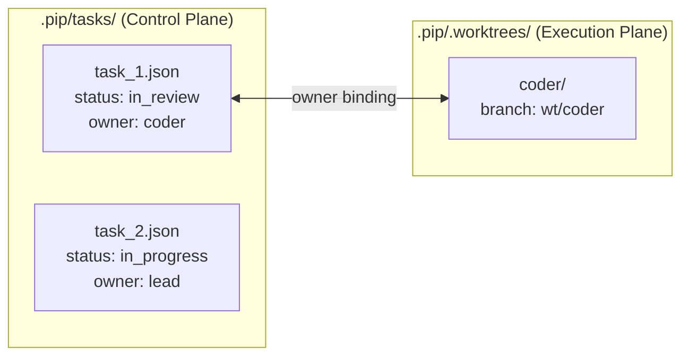

# Worktree Task Isolation

## Problem

All agents sharing a single `WORKDIR` leads to file conflicts when subagents
edit the same files concurrently.

## Architecture



- **Control plane** (`.pip/tasks/`): PlanManager tracks task state
- **Execution plane** (`.pip/.worktrees/`): WorktreeManager creates isolated git worktrees
- **Lead works in WORKDIR** on the current branch (no worktree)
- **Subagents work in worktrees** (`.pip/.worktrees/{name}/`, branch `wt/{name}`)

## Two Operating Modes

### Mode A: Lead Solo

No worktrees involved. Lead works directly in WORKDIR.

```
Task: pending → in_progress → completed
```

### Mode B: Lead + Subagents

Subagents get worktrees; Lead stays in WORKDIR. Both work concurrently.

```
Subagent: pending → in_progress → in_review → merged → completed
                                    ↑           |
                                    +-- failed --+

Lead:     pending → in_progress → completed (no merge needed)
```

## Task State Machine

| Status       | Meaning                                                 |
|-------------|----------------------------------------------------------|
| `pending`    | Not started                                             |
| `in_progress`| Being worked on                                         |
| `in_review`  | Subagent submitted, synced with main, awaiting Lead review |
| `merged`     | Lead approved merge, code in WORKDIR                    |
| `failed`     | Merge conflict or issue, subagent resolves              |
| `completed`  | Confirmed, worktree cleaned up, downstream unblocked    |

## Three-Stage Merge Flow

### Stage 1: Sync (subagent calls `task_submit`)

```
In worktree (.pip/.worktrees/{name}/):
  git merge main
  ├─ No conflict → task → "in_review", Lead notified
  └─ Conflict → task → "failed", subagent resolves and resubmits
```

### Stage 2: Integrate (Lead calls `task_update(status="merged")`)

```
Step 1: Check WORKDIR clean (reject if uncommitted changes)
Step 2: Re-sync worktree (git merge main in worktree)
Step 3: Merge into main (git merge --no-ff wt/{name})
  ├─ Success → task → "merged"
  └─ Conflict → task → "failed"
```

### Stage 3: Confirm (Lead calls `task_update(status="completed")`)

```
Remove worktree + delete feature branch
Unblock downstream tasks
```

## Tool Distribution

| Tool          | Lead | Subagent | Notes                        |
|--------------|------|----------|------------------------------|
| `task_create` | ✓    | -        |                              |
| `task_update` | ✓    | -        | merged/completed/failed      |
| `task_submit` | -    | ✓        | → in_review + sync           |
| `claim_task`  | ✓    | ✓        | Creates worktree for subagent|
| `task_board_*`| ✓    | ✓        | Read-only                    |

## Key Design Decisions

- **Worktree path**: `.pip/.worktrees/{name}/` — under `.pip/` which is `.gitignore`d
- **Branch naming**: `wt/{name}` based on subagent name (one worktree per subagent)
- **Dirty WORKDIR guard**: Reject merge if WORKDIR has uncommitted changes (no auto-stash)
- **Re-sync before integrate**: Always merge main into feature branch before merging back
- **Subagent resolves conflicts**: They know their own changes best
- **Lead reviews before confirm**: Lead sees integrated code in WORKDIR before marking completed

## Files

### Core

- `src/pip_agent/worktree.py` — `WorktreeManager` class
- `tests/test_worktree.py` — WorktreeManager unit tests

### Modified

- `src/pip_agent/tool_dispatch.py` — `_handle_task_update` (merge/cleanup hooks), `_handle_task_submit` (sync), `_handle_claim_task` (worktree creation)
- `src/pip_agent/tools.py` — `TASK_SUBMIT_SCHEMA`, updated `TASK_UPDATE_SCHEMA`, `CLAIM_TASK_SCHEMA`
- `src/pip_agent/task_graph.py` — Extended `TaskStatus` with `in_review`, `merged`, `failed`
- `src/pip_agent/team/__init__.py` — Subagent system prompt, worktree-aware tool context
- `src/pip_agent/agent.py` — WorktreeManager instantiation and wiring
- `src/pip_agent/skills/agent-team/SKILL.md` — Updated for worktree workflow
- `src/pip_agent/skills/task-planning/SKILL.md` — Updated for new states and tools

### Removed

- `src/pip_agent/subagent.py` — Inline ephemeral helper removed (all delegation via team_spawn)
